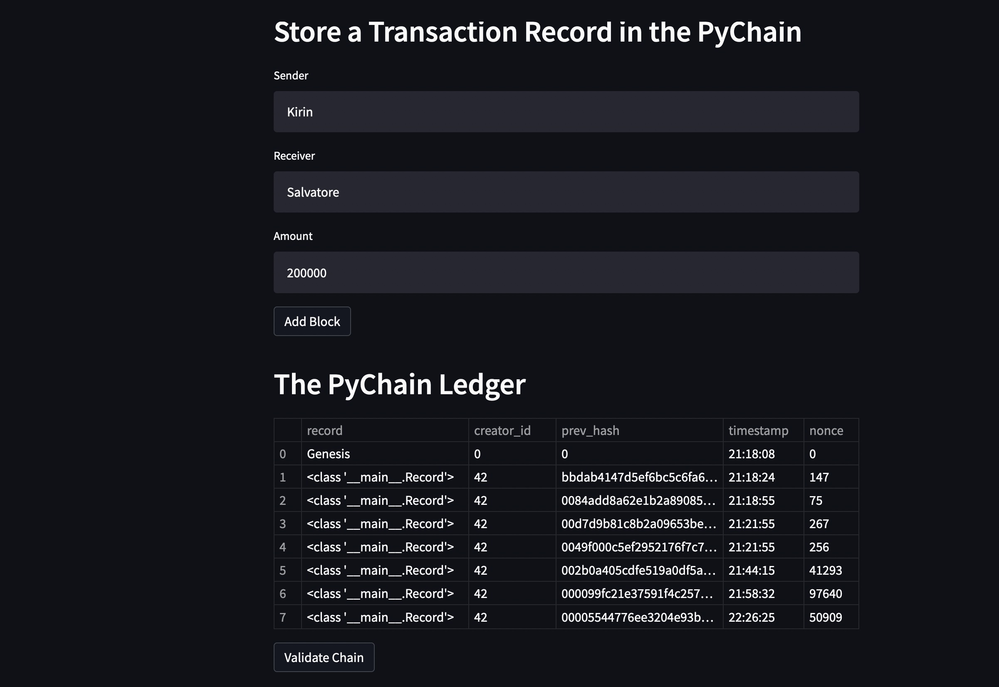
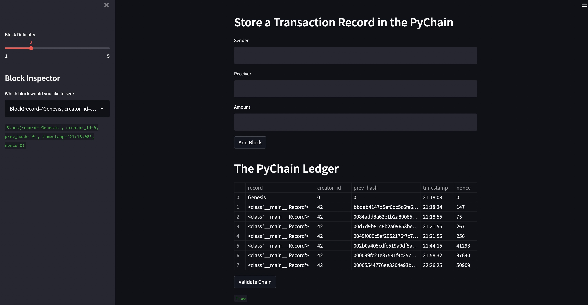

# Module 18 Challenge  

## Blockchain progamming with Streamlit  

### By:  Pete Petersen  

### Date:  05/27/2022  

## Overview  

This project is a python is a sample blockchaion programming sample with a Streamlit user interface.  THe features include the ability to add a block to the chain after showing proof of work.  The proof of work nonce is derived by incrementing through integer space and hashing the integet using sha 256 until the number preceeding zeros matches the number od zeros specified in the proof of work difficulty slider.

## Screenshot of Several Blocks being added to the chain



## Screenshot of full Blockchain Validation success

  

## Dependancies

```

#####################################################################
# Imports
import streamlit as st
from dataclasses import dataclass
from typing import Any, List
import datetime as datetime
import pandas as pd
import hashlib

#####################################################################
```
